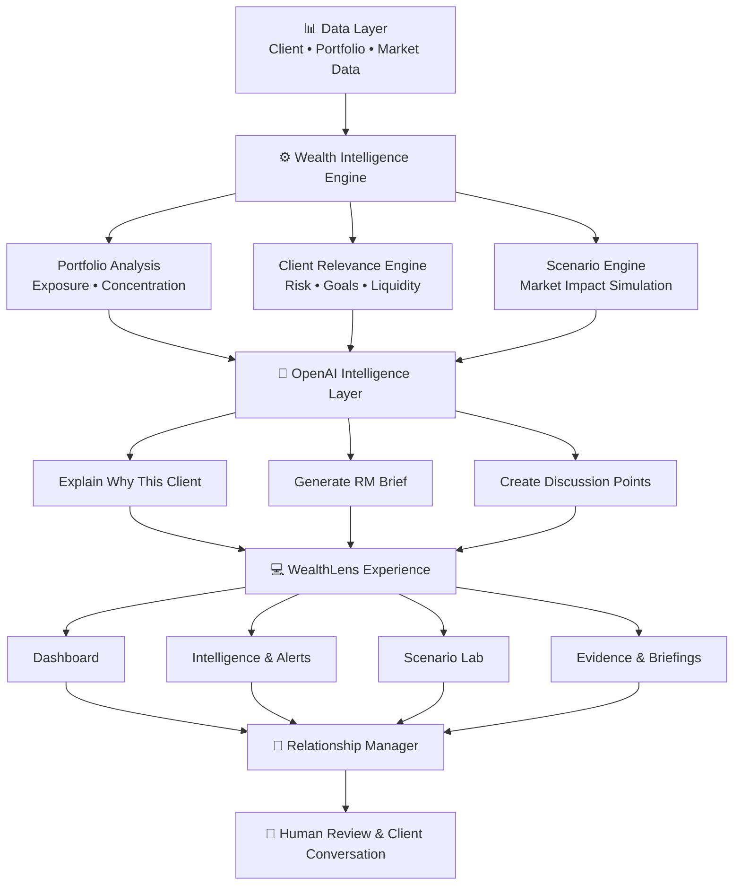
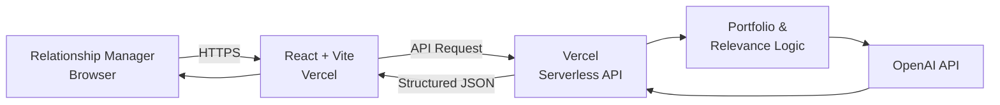

## System Architecture

WealthLens uses a **hybrid intelligence architecture** that separates deterministic financial analysis from generative AI.

Financial calculations such as portfolio exposure, concentration and scenario impact are handled by application logic. OpenAI is used to transform verified results into clear, personalised and explainable intelligence for the Relationship Manager.



### Architecture Flow

**1. Data Layer**

WealthLens receives structured information from three main sources:

* **Client Data** — risk profile, investment objectives, liquidity requirements and investment horizon
* **Portfolio Data** — holdings, asset allocation, portfolio value and exposure
* **Market Data** — relevant market events and scenarios

For the current prototype, fictional and mock data are used.

---

**2. Wealth Intelligence Engine**

Before generative AI is used, WealthLens performs deterministic analysis.

The engine is responsible for:

* Portfolio exposure analysis
* Concentration detection
* Scenario impact calculations
* Client-context analysis
* Relevance scoring

A development can therefore be evaluated not only by how significant the market event is, but by how relevant it is to an individual client's circumstances.

### Client Relevance Model

```text
Portfolio Exposure
        +
Market Impact
        +
Client Risk Profile
        +
Financial Goals
        +
Liquidity Requirements
        +
Urgency
        ↓
CLIENT RELEVANCE SCORE
```

For example, the same market event may receive a high relevance score for a client with concentrated exposure and an upcoming liquidity requirement, while receiving a much lower score for a diversified client with a long investment horizon.

---

**3. OpenAI Intelligence Layer**

OpenAI is used **after** the financial and relevance calculations have been performed.

Instead of asking the language model to calculate financial figures or independently make investment decisions, WealthLens provides the model with structured and verified information.

Example input:

```json
{
  "client": {
    "riskProfile": "Moderate",
    "liquidityNeed": 300000,
    "liquidityHorizonMonths": 4
  },
  "portfolio": {
    "portfolioValue": 4200000,
    "technologyExposure": 27.8
  },
  "scenario": {
    "technologySectorChange": -10,
    "estimatedPortfolioImpact": -168000
  },
  "relevanceScore": 92
}
```

The AI layer can then generate structured intelligence such as:

```json
{
  "priority": "HIGH",
  "whyThisClient": "The client has concentrated technology exposure combined with a near-term liquidity requirement.",
  "keyEvidence": [
    "Technology exposure: 27.8%",
    "Moderate risk profile",
    "S$300,000 liquidity requirement within 4 months"
  ],
  "rmPreparation": "Review concentration and liquidity resilience before the next client discussion."
}
```

This architecture reduces reliance on unverified AI-generated financial calculations while still benefiting from generative AI's ability to explain complex information clearly.

---

**4. WealthLens Experience**

The resulting intelligence is presented through the WealthLens interface:

* RM Dashboard
* Prioritised Intelligence
* Client Profiles
* Portfolio Analysis
* Notifications
* Evidence & Explainability
* Scenario Lab
* RM Briefings

Instead of presenting every market event as an alert, WealthLens helps Relationship Managers focus on developments that are most relevant to their clients.

---

**5. Human-in-the-Loop**

The Relationship Manager remains at the centre of the WealthLens architecture.

```text
AI identifies and explains
          ↓
RM reviews the evidence
          ↓
RM applies professional judgement
          ↓
RM engages the client
```

WealthLens does **not** autonomously execute trades or make final investment decisions.

The system is designed to augment the Relationship Manager by reducing information overload and improving preparation while preserving human judgement and the personal advisory relationship.

---

## Technical Deployment Architecture

The prototype is designed for deployment on Vercel.



The OpenAI API key is stored securely as a **server-side Vercel environment variable** and is never exposed through client-side React code.

```text
Browser
   ↓
React / Vite Frontend
   ↓
Vercel Serverless API
   ↓
Portfolio + Relevance Analysis
   ↓
OpenAI API
   ↓
Structured Intelligence
   ↓
WealthLens Dashboard
```

---

## Why This Architecture?

WealthLens follows four key design principles:

| Principle           | Approach                                                                               |
| ------------------- | -------------------------------------------------------------------------------------- |
| **Accuracy**        | Financial calculations are performed deterministically rather than generated by an LLM |
| **Explainability**  | Intelligence includes the factors and evidence behind its relevance                    |
| **Security**        | OpenAI credentials remain server-side and are never exposed to the browser             |
| **Human Oversight** | Relationship Managers review intelligence before taking client-facing action           |

### Core Design Philosophy

> **Calculate with code. Explain with AI. Decide with humans.**

This allows WealthLens to use AI where it provides the greatest value while maintaining the trust, explainability and human judgement expected in private banking.
